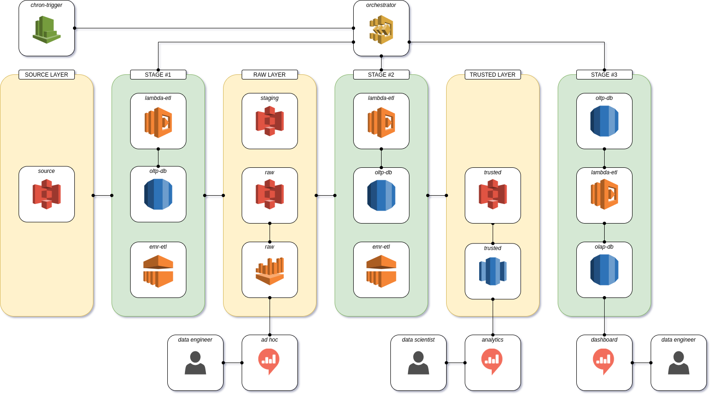

# iFood Arch - Readme

> The application is the documentation of my solution for the **[iFood data architect test](https://github.com/ifood/ifood-data-architect-test)**.

## TL;DR

## Contents

- [**1 - Introduction**](chapters/1-Introduction.md)
  - [1.1 - Overview](chapters/1-Introduction.md#11---overview)
  - [1.2 - Features](chapters/1-Introduction.md#12---features)
- [**2 - Architecture**](chapters/2-Architecture.md)
  - [2.1 - Overview](chapters/2-Architecture.md#21---overview)
  - [2.2 - Orchestration Layer](chapters/2-Architecture.md#22---orchestration-layer)
  - [2.3 - Stage #1: Raw Processing](chapters/2-Architecture.md#23---stage-1-raw-processing)
  - [2.4 - Stage #2: Trusted Processing](chapters/2-Architecture.md#24---stage-2-trusted-processing)
  - [2.5 - Stage #3: Measure Processing](chapters/2-Architecture.md#25---stage-3-measure-processing)
  - [2.6 - Visualization Layer](chapters/2-Architecture.md#26---visualization-layer)
- [**3 - Applications**](chapters/3-Applications.md)
  - [3.1 - iFood Arch Lambda ETL](chapters/3-Applications.md#31---ifood-arch-lambda-etl)
  - [3.2 - iFood Arch EMR ETL](chapters/3-Applications.md#32---ifood-arch-emr-etl)
  - [3.3 - iFood Arch Infra](chapters/3-Applications.md#33---ifood-arch-infra)
- [**4 - Data Model**](chapters/4-DataModel.md)
  - [4.1 - OLTP Database](chapters/4-DataModel.md#41---oltp-database)
  - [4.2 - OLAP Database](chapters/4-DataModel.md#42---olap-database)
  - [4.3 - Raw Data Layer](chapters/4-DataModel.md#43---raw-data-layer)
  - [4.4 - Trusted Data Layer](chapters/4-DataModel.md#44---trusted-data-layer)
- [**Appendix**](#appendix)
  - [A - Applications](#a---applications)
  - [B - Author](#b---authors)

## Appendix

### A - Applications

  - **[iFood Arch Lambda ETL](https://github.com/andre-marcos-perez/ifood-arch-lambda-etl)** - (Private) - Serverless application to inexpensively perform orchestration tasks;
  - **[iFood Arch EMR ETL](https://github.com/andre-marcos-perez/ifood-arch-emr-etl)** - (Private) - Serverless application to perform high volume ETL tasks;
  - **[iFood Arch Infra](https://github.com/andre-marcos-perez/ifood-arch-infra)** - (Private) - Application to centre infrastructure related scripts.
  
**Note**: All applications are **private** since they contain sensitive data. To ask for a read permission, please use the contact info bellow.

### B - Author

- **Andre Perez** - **[twitter](https://twitter.com/dekoperez)** - **[email](mailto:andre.marcos.perez@gmail.com)**
