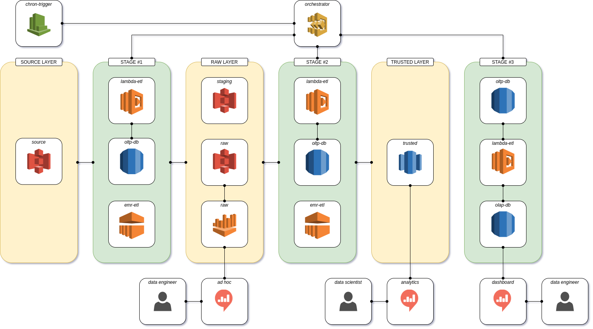

# 2 - Architecture

| Previous                              | Current          | Next                                  | Beginning              |
| ------------------------------------- | ---------------- | ------------------------------------- | ---------------------- |
| [1 - Introduction](1-Introduction.md) | 2 - Architecture | [3 - Applications](3-Applications.md) | [Readme](../README.md) |

---

### Contents

- [2.1 - Overview](#21---overview)
- [2.2 - Orchestration Layer](#22---orchestration-layer)
- [2.3 - Stage #1: Raw Processing](#23---stage-1-raw-processing)
- [2.4 - Stage #2: Trusted Processing](#24---stage-2-trusted-processing)
- [2.5 - Stage #3: Measure Processing](#25---stage-3-measure-processing)
- [2.6 - Visualization Layer](#26---visualization-layer)

---

### 2.1 - Overview

### 2.2 - Orchestration Layer

> **[iFood Arch Infra](https://github.com/andre-marcos-perez/ifood-arch-infra)** - Application to centre infrastructure related scripts

The orchestration layer is responsible for managing the entire ETL process. The **AWS CloudWatch** starts **AWS Step 
Functions** using a cron trigger that runs every day at 03:00 am BRT when all restaurants are closed, supposedly. The 
**AWS Step Functions** runs the *ifood-arch-orchestrator* flow that performs the following actions:

1. Creates an EMR cluster;
2. Runs ELT Stage #1: Raw Processing;
3. Runs ETL Stage #2: Trusted Processing;
4. Terminates the EMR cluster; 
5. Runs ETL Stage #3: Measure Processing.

Each step is described in details on their own topic. The **AWS Step Functions** *ifood-arch-orchestrator* flow definition
(yaml file and visual layout) can be found [here](https://github.com/andre-marcos-perez/ifood-arch-infra/tree/develop/orchestration/aws-step-functions).

### 2.3 - Stage #1: Raw Processing

The first stage is responsible for processing the source data into raw data.

> **[iFood Arch Lambda ETL](https://github.com/andre-marcos-perez/ifood-arch-lambda-etl)** - Serverless application to inexpensively perform orchestration tasks;

The **AWS Lambda** copies the raw data from **AWS S3** source bucket *ifood-data-architect-test-source* to the **AWS S3** 
staging bucket *ifood-arch-raw-staging* using a threading approach. It also connects to the **AWS RDS** *ifood-arch-oltp-db* 
to register the process. 

> **[iFood Arch EMR ETL](https://github.com/andre-marcos-perez/ifood-arch-emr-etl)** - Serverless application to perform high volume ETL tasks;

The orchestrator then starts multiple **AWS EMR** jobs in parallel to to process all four raw data. It reads from **AWS S3** 
staging bucket *ifood-arch-raw-staging*, enrich the data and persists it to **AWS S3** raw bucket *ifood-arch-raw* to be
further queried.

> **[iFood Arch Infra](https://github.com/andre-marcos-perez/ifood-arch-infra)** - Application to centre infrastructure related scripts

At the end, **AWS Athena** is plugged into **AWS S3** raw bucket *ifood-arch-raw* to allow further *ad hoc* queries.

### 2.4 - Stage #2: Trusted Processing

The second stage is responsible for processing the raw data into trusted data.

> **[iFood Arch Lambda ETL](https://github.com/andre-marcos-perez/ifood-arch-lambda-etl)** - Serverless application to inexpensively perform orchestration tasks;

> **[iFood Arch EMR ETL](https://github.com/andre-marcos-perez/ifood-arch-emr-etl)** - Serverless application to perform high volume ETL tasks;

> **[iFood Arch Infra](https://github.com/andre-marcos-perez/ifood-arch-infra)** - Application to centre infrastructure related scripts

At the end, **AWS Redshift** is plugged into **AWS S3** trusted bucket *ifood-arch-trusted* using **AWS Redshift Spectrum**
to allow further analytics queries. This setup essentially turns **AWS Redshift** into a caching layer for **AWS S3**, 
slightly reducing is performance but greatly saving costs.

### 2.5 - Stage #3: Measure Processing

The third and last stage is responsible for measuring the ETL process.

> **[iFood Arch Infra](https://github.com/andre-marcos-perez/ifood-arch-infra)** - Application to centre infrastructure related scripts

The **AWS Lambda** extracts the ETL process metrics from *ifood-arch-oltp-db* and loads into *ifood-arch-olap-db* using
dimensional modelling techniques to ease the usage of analytical queries to extract runtime metrics for dashboards. Thus
adding a layer of observability to the whole ETL process.

### 2.6 - Visualization Layer

TODO
